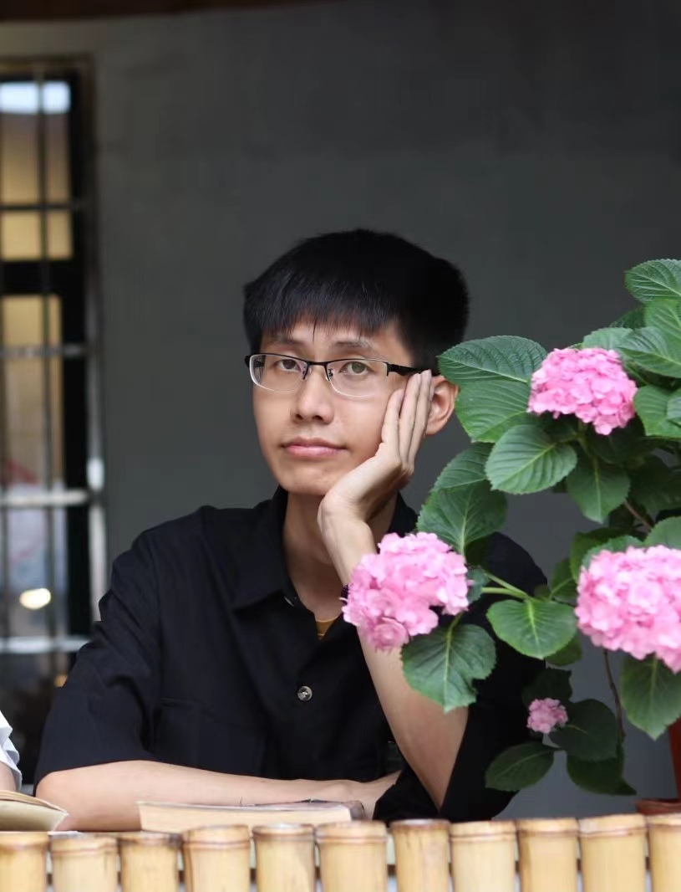

# Chulong Zhong(钟楚龙)

## Education

- 2020.09-2024.06  **South China University of Technology**, undergraduate (School of Electronics and Information)

## Information

- **Tel**: (86)15338484710

- **Email**: 3482604559@qq.com, zhongchulong7013@gmail.com
- **ORCID**: [0009-0008-8772-5691](http://orcid.org/0009-0008-8772-5691/)

## Publications

- Chulong Zhong, Xiang Yan, Yuyi Wang, Shuangping Huang, and Jin Zhong. 2023. Nash Equilibria of Two-round Auctions. In The Fifth International Conference on Distributed Artificial Intelligence (DAI ’23), November 30- December 3, 2023, Singapore, Singapore. ACM, New York, NY, USA, 8 pages. https://doi.org/10.1145/3627676.3627682

## Awards

- 2021年电信杯全国电子设计大赛华南理工大学校内赛二等奖
- 2022年电信杯电子设计大赛广州市五校联赛优胜奖
- LLD-MMRI Challenge. Liver Lesion Diagnosis on Multi-phase MRI 2023. 1st Place
## Patents

- 

## Copyrights

- 在线学习状态分析系统V1.0. 华南理工大学.2023SR0992213.

## Projects

-   2022年华南理工大学srp项目“在线学习状态分析系统”负责人  
-   2023年华南理工大学srp项目“Deepfake检测方法”负责人  
-   2023年华南理工大学“百步梯攀登计划”项目“两轮密封投标拍卖的最优化机制设计”负责人
-   2023年大学生创新创业训练(国家级)“智能书法评分系统”负责人.202310561025.

## Honors

- 2022年度华南理工大学优秀共青团员

Last updated by Chulong Zhong on November,25,2023.

